# 🔌 API Reference

**NFA × AgentKit Implementation Playbook**  
**Version:** 1.0.0  
**Last Updated:** October 7, 2025  

---

## 📋 Table of Contents

- [Overview](#overview)
- [Authentication](#authentication)
- [Core APIs](#core-apis)
- [Connector APIs](#connector-apis)
- [Proof of Prompt APIs](#proof-of-prompt-apis)
- [Marketplace APIs](#marketplace-apis)
- [WebSocket APIs](#websocket-apis)
- [Error Handling](#error-handling)
- [Rate Limiting](#rate-limiting)
- [SDKs & Libraries](#sdks--libraries)

---

## 🎯 Overview

The NFA × AgentKit platform exposes RESTful APIs, GraphQL endpoints, and WebSocket connections for real-time agent interactions. All APIs follow OpenAPI 3.0 specification and support JSON request/response formats.

### Base URLs

| Environment | Base URL | WebSocket URL |
|-------------|----------|---------------|
| **Production** | `https://api.nfa.xyz/v1` | `wss://ws.nfa.xyz` |
| **Staging** | `https://api-staging.api.nfa.xyz/v1` | `wss://ws-staging.api.nfa.xyz` |
| **Development** | `http://localhost:3000/api/v1` | `ws://localhost:3000` |

### API Architecture


---

## 🔐 Authentication

### JWT Authentication

All API requests require a valid JWT token in the `Authorization` header:

```http
Authorization: Bearer <jwt_token>
```

### Obtaining Tokens

```http
POST /auth/login
Content-Type: application/json

{
  "email": "user@example.com",
  "password": "secure_password"
}
```

**Response:**

```json
{
  "accessToken": "eyJhbGciOiJIUzI1NiIsInR5cCI6IkpXVCJ9...",
  "refreshToken": "eyJhbGciOiJIUzI1NiIsInR5cCI6IkpXVCJ9...",
  "expiresIn": 3600,
  "tokenType": "Bearer"
}
```

### Refreshing Tokens

```http
POST /auth/refresh
Content-Type: application/json

{
  "refreshToken": "eyJhbGciOiJIUzI1NiIsInR5cCI6IkpXVCJ9..."
}
```

### API Keys (for server-to-server)

```http
X-API-Key: nfa_sk_live_abc123xyz789
```

---

## 🤖 Core APIs

### Agent Management

#### Create Agent

```http
POST /agents
Content-Type: application/json
Authorization: Bearer <token>

{
  "name": "Customer Support Bot",
  "description": "AI agent for customer support",
  "model": "gpt-5-realtime",
  "persona": {
    "tone": "friendly",
    "expertise": ["product-support", "billing"],
    "voice": "professional-female"
  },
  "connectors": [
    {
      "id": "zendesk",
      "config": {
        "apiKey": "encrypted_key",
        "subdomain": "mycompany"
      }
    },
    {
      "id": "stripe",
      "config": {
        "apiKey": "encrypted_key"
      }
    }
  ],
  "guardrails": {
    "maxTokens": 4000,
    "contentFilter": true,
    "allowedDomains": ["mycompany.com"]
  }
}
```

**Response:**

```json
{
  "id": "agent_abc123",
  "name": "Customer Support Bot",
  "status": "deploying",
  "nfaTokenId": null,
  "endpoint": null,
  "createdAt": "2025-10-07T14:30:00Z",
  "estimatedDeployTime": 30
}
```

#### Get Agent

```http
GET /agents/{agentId}
Authorization: Bearer <token>
```

**Response:**

```json
{
  "id": "agent_abc123",
  "name": "Customer Support Bot",
  "description": "AI agent for customer support",
  "status": "active",
  "nfaTokenId": "42",
  "endpoint": "wss://agents.nfa-agentkit.com/agent_abc123",
  "model": "gpt-5-realtime",
  "persona": {
    "tone": "friendly",
    "expertise": ["product-support", "billing"],
    "voice": "professional-female",
    "avatarUrl": "ipfs://QmX..."
  },
  "connectors": [
    {
      "id": "zendesk",
      "status": "connected",
      "lastUsed": "2025-10-07T14:25:00Z"
    },
    {
      "id": "stripe",
      "status": "connected",
      "lastUsed": "2025-10-07T14:20:00Z"
    }
  ],
  "metrics": {
    "totalConversations": 1523,
    "avgResponseTime": 45,
    "satisfactionScore": 4.7,
    "uptime": 99.9
  },
  "createdAt": "2025-10-01T10:00:00Z",
  "updatedAt": "2025-10-07T14:30:00Z"
}
```

#### Update Agent

```http
PATCH /agents/{agentId}
Content-Type: application/json
Authorization: Bearer <token>

{
  "persona": {
    "tone": "professional"
  },
  "guardrails": {
    "maxTokens": 5000
  }
}
```

#### Delete Agent

```http
DELETE /agents/{agentId}
Authorization: Bearer <token>
```

#### List Agents

```http
GET /agents?page=1&limit=20&status=active
Authorization: Bearer <token>
```

**Response:**

```json
{
  "data": [
    {
      "id": "agent_abc123",
      "name": "Customer Support Bot",
      "status": "active",
      "nfaTokenId": "42",
      "createdAt": "2025-10-01T10:00:00Z"
    }
  ],
  "pagination": {
    "page": 1,
    "limit": 20,
    "total": 45,
    "pages": 3
  }
}
```

---

## 🔌 Connector APIs

### Connector Architecture

```mermaid
graph TB
    subgraph REGISTRY["📚 Connector Registry"]
        REG["Registry Service"]
        META["Metadata Store"]
        VERS["Version Manager"]
    end

    subgraph CONNECTORS["🔧 Connector Types"]
        DATA["Data Connectors<br/>(GDrive, GitHub, Notion)"]
        COMM["Communication<br/>(Slack, Email, SMS)"]
        COMMERCE["Commerce<br/>(Stripe, Shopify)"]
        AI["AI Services<br/>(DALL-E, Whisper)"]
        WEB["Web<br/>(HTTP, WebSocket)"]
    end

    subgraph EXECUTION["⚙️ Execution Layer"]
        POOL["Connector Pool"]
        SANDBOX["Sandbox Manager"]
        CACHE["Result Cache"]
    end

    subgraph MONITORING["📊 Monitoring"]
        METRICS["Metrics Collector"]
        LOGS["Log Aggregator"]
        ALERTS["Alert Manager"]
    end

    REG --> DATA
    REG --> COMM
    REG --> COMMERCE
    REG --> AI
    REG --> WEB

    DATA --> POOL
    COMM --> POOL
    COMMERCE --> POOL
    AI --> POOL
    WEB --> POOL

    POOL --> SANDBOX
    SANDBOX --> CACHE

    POOL --> METRICS
    POOL --> LOGS
    METRICS --> ALERTS

    style REGISTRY fill:#f0f9ff,stroke:#00F0FF,stroke-width:3px
    style CONNECTORS fill:#f3fff6,stroke:#12b886,stroke-width:3px
    style EXECUTION fill:#fffbeb,stroke:#f59e0b,stroke-width:3px
    style MONITORING fill:#faf5ff,stroke:#9333ea,stroke-width:3px
```



### List Available Connectors

```http
GET /connectors?category=communication&verified=true
Authorization: Bearer <token>
```

**Response:**

```json
{
  "data": [
    {
      "id": "slack",
      "name": "Slack",
      "description": "Send messages and interact with Slack workspaces",
      "category": "communication",
      "version": "2.1.0",
      "verified": true,
      "author": "NFA Team",
      "pricing": "free",
      "capabilities": [
        "send-message",
        "read-channels",
        "manage-users"
      ],
      "requiredAuth": ["oauth2"],
      "documentation": "https://docs.nfa-agentkit.com/connectors/slack",
      "icon": "https://cdn.nfa-agentkit.com/icons/slack.svg",
      "installs": 15234,
      "rating": 4.8
    },
    {
      "id": "email",
      "name": "Email (SMTP)",
      "description": "Send emails via SMTP",
      "category": "communication",
      "version": "1.5.0",
      "verified": true,
      "author": "NFA Team",
      "pricing": "free",
      "capabilities": [
        "send-email",
        "send-attachment"
      ],
      "requiredAuth": ["smtp-credentials"],
      "documentation": "https://docs.nfa-agentkit.com/connectors/email",
      "icon": "https://cdn.nfa-agentkit.com/icons/email.svg",
      "installs": 28901,
      "rating": 4.9
    }
  ],
  "pagination": {
    "page": 1,
    "limit": 20,
    "total": 127,
    "pages": 7
  }
}
```

### Get Connector Details

```http
GET /connectors/{connectorId}
Authorization: Bearer <token>
```

**Response:**

```json
{
  "id": "slack",
  "name": "Slack",
  "description": "Send messages and interact with Slack workspaces",
  "category": "communication",
  "version": "2.1.0",
  "verified": true,
  "author": "NFA Team",
  "pricing": "free",
  "capabilities": [
    {
      "id": "send-message",
      "name": "Send Message",
      "description": "Send a message to a Slack channel",
      "parameters": [
        {
          "name": "channel",
          "type": "string",
          "required": true,
          "description": "Channel ID or name"
        },
        {
          "name": "text",
          "type": "string",
          "required": true,
          "description": "Message text"
        },
        {
          "name": "attachments",
          "type": "array",
          "required": false,
          "description": "Message attachments"
        }
      ],
      "returns": {
        "type": "object",
        "properties": {
          "ok": "boolean",
          "ts": "string",
          "channel": "string"
        }
      }
    }
  ],
  "authentication": {
    "type": "oauth2",
    "authUrl": "https://slack.com/oauth/v2/authorize",
    "tokenUrl": "https://slack.com/api/oauth.v2.access",
    "scopes": ["chat:write", "channels:read"]
  },
  "configuration": {
    "workspace": {
      "type": "string",
      "required": true,
      "description": "Slack workspace URL"
    }
  },
  "examples": [
    {
      "title": "Send a simple message",
      "code": "await slack.sendMessage({\n  channel: '#general',\n  text: 'Hello from NFA!'\n});"
    }
  ],
  "changelog": [
    {
      "version": "2.1.0",
      "date": "2025-10-01",
      "changes": ["Added attachment support", "Improved error handling"]
    }
  ],
  "documentation": "https://docs.nfa-agentkit.com/connectors/slack",
  "repository": "https://github.com/nfa-agentkit/connector-slack",
  "icon": "https://cdn.nfa-agentkit.com/icons/slack.svg",
  "installs": 15234,
  "rating": 4.8,
  "reviews": 342
}
```

### Install Connector

```http
POST /agents/{agentId}/connectors
Content-Type: application/json
Authorization: Bearer <token>

{
  "connectorId": "slack",
  "version": "2.1.0",
  "config": {
    "workspace": "mycompany.slack.com"
  },
  "auth": {
    "type": "oauth2",
    "accessToken": "xoxb-..."
  }
}
```

**Response:**

```json
{
  "id": "conn_xyz789",
  "connectorId": "slack",
  "agentId": "agent_abc123",
  "status": "connected",
  "version": "2.1.0",
  "installedAt": "2025-10-07T14:30:00Z",
  "lastUsed": null,
  "config": {
    "workspace": "mycompany.slack.com"
  }
}
```

### Execute Connector Action

```http
POST /agents/{agentId}/connectors/{connectorId}/execute
Content-Type: application/json
Authorization: Bearer <token>

{
  "action": "send-message",
  "parameters": {
    "channel": "#general",
    "text": "Hello from NFA Agent!"
  }
}
```

**Response:**

```json
{
  "executionId": "exec_def456",
  "connectorId": "slack",
  "action": "send-message",
  "status": "success",
  "result": {
    "ok": true,
    "ts": "1696694400.123456",
    "channel": "C01234567"
  },
  "executionTime": 245,
  "timestamp": "2025-10-07T14:30:00Z",
  "popId": "pop_ghi789"
}
```

### Connector Execution Flow


### List Agent Connectors

```http
GET /agents/{agentId}/connectors
Authorization: Bearer <token>
```

**Response:**

```json
{
  "data": [
    {
      "id": "conn_xyz789",
      "connectorId": "slack",
      "name": "Slack",
      "status": "connected",
      "version": "2.1.0",
      "installedAt": "2025-10-07T14:30:00Z",
      "lastUsed": "2025-10-07T15:45:00Z",
      "usageCount": 234,
      "errorRate": 0.02
    }
  ]
}
```

### Update Connector Config

```http
PATCH /agents/{agentId}/connectors/{connectorId}
Content-Type: application/json
Authorization: Bearer <token>

{
  "config": {
    "workspace": "newcompany.slack.com"
  }
}
```

### Remove Connector

```http
DELETE /agents/{agentId}/connectors/{connectorId}
Authorization: Bearer <token>
```

### Connector Metrics

```http
GET /agents/{agentId}/connectors/{connectorId}/metrics?period=7d
Authorization: Bearer <token>
```

**Response:**

```json
{
  "connectorId": "slack",
  "period": "7d",
  "metrics": {
    "totalCalls": 1523,
    "successfulCalls": 1498,
    "failedCalls": 25,
    "successRate": 98.36,
    "avgExecutionTime": 245,
    "p50ExecutionTime": 180,
    "p95ExecutionTime": 450,
    "p99ExecutionTime": 800,
    "totalExecutionTime": 373135,
    "errorBreakdown": {
      "rate_limit": 15,
      "auth_error": 8,
      "timeout": 2
    },
    "dailyUsage": [
      {
        "date": "2025-10-01",
        "calls": 218,
        "errors": 3
      },
      {
        "date": "2025-10-02",
        "calls": 195,
        "errors": 2
      }
    ]
  }
}
```

---

## 🔐 Proof of Prompt APIs

### Record Interaction

```http
POST /pop/interactions
Content-Type: application/json
Authorization: Bearer <token>

{
  "agentTokenId": "42",
  "userId": "user_abc123",
  "promptHash": "0x1a2b3c...",
  "responseHash": "0x4d5e6f...",
  "contextHash": "0x7g8h9i...",
  "connectorCalls": [
    {
      "connectorId": "slack",
      "connectorVersion": "2.1.0",
      "callTimestamp": 1696694400000,
      "inputHash": "0xabc123...",
      "outputHash": "0xdef456...",
      "executionTime": 245,
      "success": true
    }
  ],
  "timestamp": 1696694400000,
  "duration": 2300,
  "tokenUsage": {
    "input": 150,
    "output": 320
  }
}
```

**Response:**

```json
{
  "id": "interaction_xyz789",
  "status": "pending",
  "merkleLeafHash": "0xghi789...",
  "estimatedAnchorTime": 300,
  "createdAt": "2025-10-07T14:30:00Z"
}
```

### Get Interaction

```http
GET /pop/interactions/{interactionId}
Authorization: Bearer <token>
```

**Response:**

```json
{
  "id": "interaction_xyz789",
  "agentTokenId": "42",
  "userId": "user_abc123",
  "promptHash": "0x1a2b3c...",
  "responseHash": "0x4d5e6f...",
  "contextHash": "0x7g8h9i...",
  "connectorCalls": [
    {
      "connectorId": "slack",
      "connectorVersion": "2.1.0",
      "callTimestamp": 1696694400000,
      "inputHash": "0xabc123...",
      "outputHash": "0xdef456...",
      "executionTime": 245,
      "success": true
    }
  ],
  "timestamp": 1696694400000,
  "duration": 2300,
  "tokenUsage": {
    "input": 150,
    "output": 320
  },
  "merkleLeafHash": "0xghi789...",
  "merkleRoot": "0xjkl012...",
  "merkleProof": ["0xmno345...", "0xpqr678..."],
  "blockchainTxHash": "0xstu901...",
  "ipfsProofCid": "QmX...",
  "status": "anchored",
  "createdAt": "2025-10-07T14:30:00Z",
  "anchoredAt": "2025-10-07T14:35:00Z"
}
```

### Verify Interaction

```http
POST /pop/verify
Content-Type: application/json

{
  "interactionId": "interaction_xyz789"
}
```

**Response:**

```json
{
  "interactionId": "interaction_xyz789",
  "valid": true,
  "proof": {
    "merkleRoot": "0xjkl012...",
    "merkleProof": ["0xmno345...", "0xpqr678..."],
    "blockchainTxHash": "0xstu901...",
    "blockNumber": 12345678,
    "blockTimestamp": 1696694700,
    "ipfsCid": "QmX..."
  },
  "verifiedAt": "2025-10-07T14:40:00Z"
}
```

### Batch Verify

```http
POST /pop/verify/batch
Content-Type: application/json

{
  "interactionIds": [
    "interaction_xyz789",
    "interaction_abc123",
    "interaction_def456"
  ]
}
```

**Response:**

```json
{
  "total": 3,
  "valid": 3,
  "invalid": 0,
  "results": [
    {
      "interactionId": "interaction_xyz789",
      "valid": true,
      "verifiedAt": "2025-10-07T14:40:00Z"
    },
    {
      "interactionId": "interaction_abc123",
      "valid": true,
      "verifiedAt": "2025-10-07T14:40:00Z"
    },
    {
      "interactionId": "interaction_def456",
      "valid": true,
      "verifiedAt": "2025-10-07T14:40:00Z"
    }
  ]
}
```

### Get Batch Status

```http
GET /pop/batches/{batchId}
Authorization: Bearer <token>
```

**Response:**

```json
{
  "batchId": "batch_ghi789",
  "agentTokenId": "42",
  "interactionCount": 100,
  "merkleRoot": "0xjkl012...",
  "blockchainTxHash": "0xstu901...",
  "ipfsCid": "QmX...",
  "status": "anchored",
  "connectorUsage": {
    "slack": {
      "callCount": 45,
      "totalExecutionTime": 11025,
      "successRate": 100
    },
    "email": {
      "callCount": 30,
      "totalExecutionTime": 24000,
      "successRate": 96.67
    }
  },
  "createdAt": "2025-10-07T14:30:00Z",
  "anchoredAt": "2025-10-07T14:35:00Z"
}
```

---

## 🛒 Marketplace APIs

### List NFAs

```http
GET /marketplace/nfas?category=customer-support&sort=popular&page=1&limit=20
```

**Response:**

```json
{
  "data": [
    {
      "tokenId": "42",
      "name": "Customer Support Pro",
      "description": "Expert customer support agent",
      "category": "customer-support",
      "price": "0.5",
      "currency": "BSV",
      "owner": "0x1234...",
      "creator": "0x5678...",
      "rating": 4.8,
      "reviews": 234,
      "sales": 1523,
      "capabilities": [
        "zendesk-integration",
        "stripe-billing",
        "email-support"
      ],
      "connectors": ["zendesk", "stripe", "email"],
      "avatarUrl": "ipfs://QmX...",
      "previewUrl": "https://preview.nfa-agentkit.com/42",
      "listedAt": "2025-10-01T10:00:00Z"
    }
  ],
  "pagination": {
    "page": 1,
    "limit": 20,
    "total": 456,
    "pages": 23
  }
}
```

### Get NFA Details

```http
GET /marketplace/nfas/{tokenId}
```

**Response:**

```json
{
  "tokenId": "42",
  "name": "Customer Support Pro",
  "description": "Expert customer support agent with Zendesk and Stripe integration",
  "category": "customer-support",
  "price": "0.5",
  "currency": "BSV",
  "owner": "0x1234...",
  "creator": "0x5678...",
  "rating": 4.8,
  "reviews": 234,
  "sales": 1523,
  "capabilities": [
    {
      "id": "zendesk-integration",
      "name": "Zendesk Integration",
      "description": "Full Zendesk ticket management"
    },
    {
      "id": "stripe-billing",
      "name": "Stripe Billing",
      "description": "Handle billing inquiries"
    }
  ],
  "connectors": [
    {
      "id": "zendesk",
      "version": "3.0.0"
    },
    {
      "id": "stripe",
      "version": "2.5.0"
    },
    {
      "id": "email",
      "version": "1.5.0"
    }
  ],
  "persona": {
    "tone": "friendly-professional",
    "expertise": ["customer-service", "billing", "technical-support"],
    "voice": "professional-female"
  },
  "metrics": {
    "avgResponseTime": 45,
    "satisfactionScore": 4.7,
    "totalConversations": 15234,
    "uptime": 99.9
  },
  "proofOfPrompt": {
    "totalInteractions": 15234,
    "verifiedInteractions": 15234,
    "lastAnchoredAt": "2025-10-07T14:00:00Z"
  },
  "avatarUrl": "ipfs://QmX...",
  "voiceUrl": "ipfs://QmY...",
  "previewUrl": "https://preview.nfa-agentkit.com/42",
  "metadata": {
    "personaHash": "0xabc123...",
    "capabilityGraph": "0xdef456...",
    "version": 3
  },
  "royalties": {
    "creator": 5,
    "connectorAuthors": 2
  },
  "listedAt": "2025-10-01T10:00:00Z",
  "updatedAt": "2025-10-07T14:30:00Z"
}
```

### Purchase NFA

```http
POST /marketplace/nfas/{tokenId}/purchase
Content-Type: application/json
Authorization: Bearer <token>

{
  "paymentMethod": "bsv",
  "walletAddress": "0x9abc..."
}
```

**Response:**

```json
{
  "orderId": "order_xyz789",
  "tokenId": "42",
  "price": "0.5",
  "currency": "BSV",
  "status": "pending",
  "paymentAddress": "1A1zP1eP5QGefi2DMPTfTL5SLmv7DivfNa",
  "expiresAt": "2025-10-07T15:00:00Z",
  "createdAt": "2025-10-07T14:30:00Z"
}
```

---

## 🔌 WebSocket APIs

### Connection

```javascript
const ws = new WebSocket('wss://ws.nfa-agentkit.com');

ws.onopen = () => {
  // Authenticate
  ws.send(JSON.stringify({
    type: 'auth',
    token: 'Bearer <jwt_token>'
  }));
};
```

### Start Conversation

```javascript
ws.send(JSON.stringify({
  type: 'conversation.start',
  agentId: 'agent_abc123',
  userId: 'user_xyz789',
  context: {
    previousMessages: [],
    userProfile: {}
  }
}));
```

### Send Message

```javascript
ws.send(JSON.stringify({
  type: 'message.send',
  conversationId: 'conv_def456',
  message: 'What is the weather in San Francisco?'
}));
```

### Receive Messages

```javascript
ws.onmessage = (event) => {
  const data = JSON.parse(event.data);
  
  switch (data.type) {
    case 'message.start':
      console.log('Agent is typing...');
      break;
      
    case 'message.delta':
      // Stream response tokens
      console.log(data.delta);
      break;
      
    case 'message.complete':
      console.log('Message complete:', data.message);
      console.log('PoP ID:', data.popId);
      break;
      
    case 'connector.call':
      console.log('Connector called:', data.connectorId);
      break;
      
    case 'error':
      console.error('Error:', data.error);
      break;
  }
};
```

### WebSocket Message Flow


---

## ❌ Error Handling

### Error Response Format

```json
{
  "error": {
    "code": "CONNECTOR_EXECUTION_FAILED",
    "message": "Failed to execute connector action",
    "details": {
      "connectorId": "slack",
      "action": "send-message",
      "reason": "Rate limit exceeded"
    },
    "timestamp": "2025-10-07T14:30:00Z",
    "requestId": "req_abc123"
  }
}
```

### Error Codes

| Code | HTTP Status | Description |
|------|-------------|-------------|
| `UNAUTHORIZED` | 401 | Invalid or missing authentication |
| `FORBIDDEN` | 403 | Insufficient permissions |
| `NOT_FOUND` | 404 | Resource not found |
| `RATE_LIMIT_EXCEEDED` | 429 | Too many requests |
| `VALIDATION_ERROR` | 400 | Invalid request parameters |
| `CONNECTOR_NOT_FOUND` | 404 | Connector not found |
| `CONNECTOR_AUTH_FAILED` | 401 | Connector authentication failed |
| `CONNECTOR_EXECUTION_FAILED` | 500 | Connector execution error |
| `AGENT_NOT_FOUND` | 404 | Agent not found |
| `AGENT_DEPLOYMENT_FAILED` | 500 | Agent deployment error |
| `POP_VERIFICATION_FAILED` | 400 | Proof verification failed |
| `BLOCKCHAIN_ERROR` | 500 | Blockchain transaction error |
| `INTERNAL_ERROR` | 500 | Internal server error |

---

## ⏱️ Rate Limiting

### Rate Limit Headers

```http
X-RateLimit-Limit: 1000
X-RateLimit-Remaining: 999
X-RateLimit-Reset: 1696694400
```

### Rate Limits by Tier

| Tier | Requests/Hour | Concurrent Connections | Burst Limit |
|------|---------------|------------------------|-------------|
| **Free** | 1,000 | 5 | 50 |
| **Pro** | 10,000 | 20 | 200 |
| **Enterprise** | 100,000 | 100 | 1,000 |

### Rate Limit Exceeded Response

```json
{
  "error": {
    "code": "RATE_LIMIT_EXCEEDED",
    "message": "Rate limit exceeded",
    "details": {
      "limit": 1000,
      "remaining": 0,
      "resetAt": "2025-10-07T15:00:00Z"
    }
  }
}
```

---

## 📚 SDKs & Libraries

### Official SDKs


### JavaScript/TypeScript SDK

```bash
npm install @nfa/agentkit
```

```typescript
import { AgentKit, Connector } from '@nfa/agentkit';

const agent = new AgentKit({
  apiKey: process.env.NFA_API_KEY,
  agentId: 'agent_abc123'
});

// Start conversation
const conversation = await agent.startConversation({
  userId: 'user_xyz789'
});

// Send message
const response = await conversation.sendMessage(
  'What is the weather in San Francisco?'
);

console.log(response.message);
console.log('PoP ID:', response.popId);

// Execute connector
const result = await agent.executeConnector('slack', 'send-message', {
  channel: '#general',
  text: 'Hello from NFA!'
});
```

### Python SDK

```bash
pip install nfa-agentkit
```

```python
from nfa_agentkit import AgentKit

agent = AgentKit(
    api_key=os.getenv('NFA_API_KEY'),
    agent_id='agent_abc123'
)

# Start conversation
conversation = agent.start_conversation(user_id='user_xyz789')

# Send message
response = conversation.send_message(
    'What is the weather in San Francisco?'
)

print(response.message)
print(f'PoP ID: {response.pop_id}')

# Execute connector
result = agent.execute_connector(
    'slack',
    'send-message',
    {
        'channel': '#general',
        'text': 'Hello from NFA!'
    }
)
```

---

## 🔗 Related Documentation

- [Proof of Prompt Specification](./PROOFOFPROMPT.md)
- [Architecture Overview](./ARCHITECTURE.md)

---

## 📄 License

MIT License - see [LICENSE](LICENSE) for details
