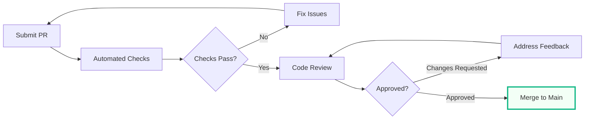
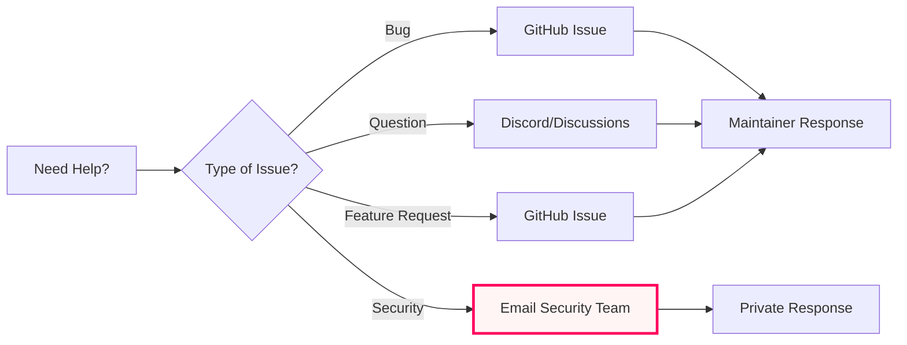
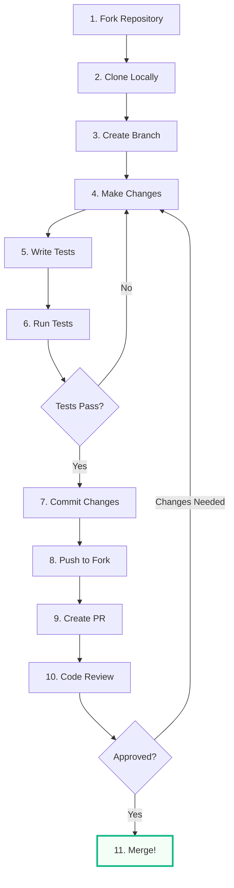

# 🤝 Contributing to NFA × AgentKit

**Welcome!** We're excited you want to contribute to the NFA × AgentKit Implementation Playbook.

This guide will help you get started with contributing code, documentation, examples, and more.

---

## 📋 Table of Contents

- [Code of Conduct](#code-of-conduct)
- [Getting Started](#getting-started)
- [Development Setup](#development-setup)
- [How to Contribute](#how-to-contribute)
- [Pull Request Process](#pull-request-process)
- [Coding Standards](#coding-standards)
- [Testing Guidelines](#testing-guidelines)
- [Documentation](#documentation)
- [Community](#community)

---

## 📜 Code of Conduct

### Our Pledge

We are committed to providing a welcoming and inclusive environment for all contributors, regardless of:
- Experience level
- Gender identity and expression
- Sexual orientation
- Disability
- Personal appearance
- Body size
- Race
- Ethnicity
- Age
- Religion
- Nationality

### Our Standards

**Positive behaviors include:**
- Using welcoming and inclusive language
- Being respectful of differing viewpoints
- Gracefully accepting constructive criticism
- Focusing on what's best for the community
- Showing empathy towards other community members

**Unacceptable behaviors include:**
- Trolling, insulting/derogatory comments, and personal attacks
- Public or private harassment
- Publishing others' private information without permission
- Other conduct which could reasonably be considered inappropriate

---

## 🚀 Getting Started

### Prerequisites

Before contributing, ensure you have:

```bash
# Required
node >= 18.0.0
npm >= 9.0.0
git >= 2.30.0

# Recommended
docker >= 20.10.0
vscode (or your preferred IDE)
```

### Fork & Clone

1. **Fork the repository** on GitHub
2. **Clone your fork** locally:

```bash
git clone https://github.com/YOUR_USERNAME/nfa-agentkit.git
cd nfa-agentkit
```

3. **Add upstream remote**:

```bash
git remote add upstream https://github.com/christelbuchanan/nfa-agentkit-playbook.git
```

4. **Verify remotes**:

```bash
git remote -v
# origin    https://github.com/YOUR_USERNAME/nfa-agentkit.git (fetch)
# origin    https://github.com/YOUR_USERNAME/nfa-agentkit.git (push)
# upstream  https://github.com/christelbuchanan/nfa-agentkit-playbook.git (fetch)
# upstream  https://github.com/christelbuchanan/nfa-agentkit-playbook.git (push)
```

---

## 🛠️ Development Setup

### Install Dependencies

```bash
# Install all dependencies
npm install

# Install development tools
npm install --save-dev

# Verify installation
npm run verify
```

### Environment Configuration

```bash
# Copy example environment file
cp .env.example .env

# Edit .env with your credentials
# Required variables:
# - OPENAI_API_KEY
# - SUPABASE_URL
# - SUPABASE_ANON_KEY
# - IPFS_API_KEY
# - BAP578_CONTRACT_ADDRESS
```

### Database Setup

```bash
# Run migrations
npm run db:migrate

# Seed development data
npm run db:seed

# Verify database connection
npm run db:verify
```

### Start Development Server

```bash
# Start all services
npm run dev

# Or start individual services:
npm run dev:api      # API server only
npm run dev:web      # Web UI only
npm run dev:agents   # Agent runtime only
```

---

## 💡 How to Contribute

### Types of Contributions

We welcome various types of contributions:

#### 🐛 Bug Reports

Found a bug? Please create an issue with:
- Clear, descriptive title
- Steps to reproduce
- Expected vs actual behavior
- Screenshots (if applicable)
- Environment details (OS, Node version, etc.)

**Template:**
```markdown
**Bug Description**
A clear description of the bug.

**Steps to Reproduce**
1. Go to '...'
2. Click on '...'
3. See error

**Expected Behavior**
What you expected to happen.

**Actual Behavior**
What actually happened.

**Environment**
- OS: [e.g., macOS 13.0]
- Node: [e.g., 18.16.0]
- Browser: [e.g., Chrome 115]

**Screenshots**
If applicable, add screenshots.
```

#### ✨ Feature Requests

Have an idea? Create an issue with:
- Clear use case
- Proposed solution
- Alternative solutions considered
- Impact on existing features

**Template:**
```markdown
**Feature Description**
A clear description of the feature.

**Use Case**
Why is this feature needed? Who will benefit?

**Proposed Solution**
How should this feature work?

**Alternatives Considered**
What other approaches did you consider?

**Additional Context**
Any other relevant information.
```

#### 📝 Documentation

Improve our docs by:
- Fixing typos or unclear explanations
- Adding examples or tutorials
- Translating documentation
- Creating video guides

#### 🔧 Code Contributions

Contribute code by:
- Fixing bugs
- Implementing features
- Improving performance
- Adding tests
- Refactoring code

#### 🎨 Design Contributions

Help with:
- UI/UX improvements
- Visual assets (icons, illustrations)
- Accessibility enhancements
- Design system components

---

## 🔄 Pull Request Process

### Branch Naming Convention

Use descriptive branch names following this pattern:

```bash
# Feature branches
feature/add-telegram-connector
feature/improve-avatar-rendering

# Bug fix branches
fix/conversation-memory-leak
fix/auth-token-expiration

# Documentation branches
docs/update-api-reference
docs/add-deployment-guide

# Refactoring branches
refactor/simplify-agent-builder
refactor/optimize-vector-search
```

### Creating a Pull Request

1. **Create a new branch**:

```bash
git checkout -b feature/your-feature-name
```

2. **Make your changes** following our [coding standards](#coding-standards)

3. **Commit your changes**:

```bash
# Stage changes
git add .

# Commit with descriptive message
git commit -m "feat: add telegram connector integration"
```

**Commit Message Format:**
```
<type>(<scope>): <subject>

<body>

<footer>
```

**Types:**
- `feat`: New feature
- `fix`: Bug fix
- `docs`: Documentation changes
- `style`: Code style changes (formatting, etc.)
- `refactor`: Code refactoring
- `test`: Adding or updating tests
- `chore`: Maintenance tasks

**Examples:**
```bash
feat(connectors): add telegram bot integration
fix(auth): resolve token refresh race condition
docs(api): update agent creation endpoint examples
refactor(agents): simplify capability graph generation
test(pop): add merkle tree verification tests
```

4. **Push to your fork**:

```bash
git push origin feature/your-feature-name
```

5. **Open a Pull Request** on GitHub with:
   - Clear title and description
   - Reference to related issues
   - Screenshots/videos (if UI changes)
   - Checklist of changes

**PR Template:**
```markdown
## Description
Brief description of changes.

## Related Issues
Fixes #123
Relates to #456

## Type of Change
- [ ] Bug fix
- [ ] New feature
- [ ] Breaking change
- [ ] Documentation update

## Changes Made
- Added X functionality
- Fixed Y bug
- Updated Z documentation

## Testing
- [ ] Unit tests pass
- [ ] Integration tests pass
- [ ] Manual testing completed

## Screenshots
If applicable, add screenshots.

## Checklist
- [ ] Code follows style guidelines
- [ ] Self-review completed
- [ ] Comments added for complex code
- [ ] Documentation updated
- [ ] No new warnings generated
- [ ] Tests added/updated
- [ ] All tests passing
```

### Review Process



**What happens after you submit:**

1. **Automated Checks** (1-5 minutes)
   - Linting
   - Type checking
   - Unit tests
   - Build verification

2. **Code Review** (1-3 days)
   - Maintainer reviews code
   - Provides feedback
   - Requests changes if needed

3. **Approval & Merge** (1 day)
   - Once approved, PR is merged
   - Changes deployed to staging
   - Released in next version

---

## 📏 Coding Standards

### TypeScript Guidelines

```typescript
// ✅ DO: Use explicit types
interface AgentConfig {
  name: string;
  model: 'gpt-5-realtime' | 'gpt-4-turbo';
  tools: string[];
  guardrails: {
    maxTokens: number;
    contentFilter: boolean;
  };
}

// ❌ DON'T: Use 'any' type
function processAgent(config: any) { }

// ✅ DO: Use proper error handling
async function createAgent(config: AgentConfig): Promise<Agent> {
  try {
    const agent = await AgentKit.create(config);
    return agent;
  } catch (error) {
    if (error instanceof ValidationError) {
      throw new AgentCreationError('Invalid config', { cause: error });
    }
    throw error;
  }
}

// ✅ DO: Use descriptive variable names
const userConversationHistory = await fetchHistory(userId);

// ❌ DON'T: Use single-letter variables (except in loops)
const h = await fetchHistory(userId);
```

### Code Organization

```typescript
// File structure for a new feature
src/
├── features/
│   └── telegram-connector/
│       ├── index.ts              // Public API
│       ├── telegram.service.ts   // Business logic
│       ├── telegram.types.ts     // Type definitions
│       ├── telegram.utils.ts     // Helper functions
│       ├── telegram.test.ts      // Unit tests
│       └── README.md             // Feature documentation
```

### Naming Conventions

```typescript
// Classes: PascalCase
class AgentBuilder { }

// Interfaces: PascalCase with 'I' prefix (optional)
interface IAgentConfig { }
interface AgentConfig { }  // Also acceptable

// Functions: camelCase
function createAgent() { }
async function fetchConversationHistory() { }

// Constants: UPPER_SNAKE_CASE
const MAX_RETRY_ATTEMPTS = 3;
const DEFAULT_TIMEOUT_MS = 5000;

// Private members: prefix with underscore
class Agent {
  private _internalState: State;
  private _processMessage() { }
}
```

### Comments & Documentation

```typescript
/**
 * Creates a new NFA agent with the specified configuration.
 * 
 * @param config - Agent configuration including model, tools, and guardrails
 * @returns Promise resolving to the created agent instance
 * @throws {ValidationError} If config is invalid
 * @throws {AgentCreationError} If agent creation fails
 * 
 * @example
 * ```typescript
 * const agent = await createAgent({
 *   name: 'Support Bot',
 *   model: 'gpt-5-realtime',
 *   tools: ['zendesk', 'email']
 * });
 * ```
 */
async function createAgent(config: AgentConfig): Promise<Agent> {
  // Implementation
}

// Use inline comments for complex logic
function calculateMerkleRoot(interactions: Interaction[]): string {
  // Hash each interaction individually
  const hashes = interactions.map(i => hashInteraction(i));
  
  // Build merkle tree bottom-up
  while (hashes.length > 1) {
    // Pair up hashes and combine them
    const paired = pairHashes(hashes);
    hashes = paired.map(([left, right]) => combineHashes(left, right));
  }
  
  return hashes[0];
}
```

---

## 🧪 Testing Guidelines

### Test Structure

```typescript
// telegram.test.ts
import { describe, it, expect, beforeEach, afterEach } from 'vitest';
import { TelegramConnector } from './telegram.service';

describe('TelegramConnector', () => {
  let connector: TelegramConnector;
  
  beforeEach(() => {
    connector = new TelegramConnector({
      botToken: 'test-token',
      webhookUrl: 'https://test.com/webhook'
    });
  });
  
  afterEach(() => {
    connector.disconnect();
  });
  
  describe('sendMessage', () => {
    it('should send message successfully', async () => {
      const result = await connector.sendMessage({
        chatId: '123',
        text: 'Hello'
      });
      
      expect(result.success).toBe(true);
      expect(result.messageId).toBeDefined();
    });
    
    it('should handle rate limiting', async () => {
      // Send multiple messages rapidly
      const promises = Array(10).fill(null).map(() =>
        connector.sendMessage({ chatId: '123', text: 'Test' })
      );
      
      await expect(Promise.all(promises)).rejects.toThrow('Rate limit exceeded');
    });
    
    it('should retry on network errors', async () => {
      // Mock network failure
      mockNetworkError();
      
      const result = await connector.sendMessage({
        chatId: '123',
        text: 'Hello'
      });
      
      expect(result.retryCount).toBeGreaterThan(0);
      expect(result.success).toBe(true);
    });
  });
});
```

### Running Tests

```bash
# Run all tests
npm test

# Run tests in watch mode
npm run test:watch

# Run tests with coverage
npm run test:coverage

# Run specific test file
npm test telegram.test.ts

# Run tests matching pattern
npm test -- --grep "sendMessage"
```

### Test Coverage Requirements

- **Minimum coverage**: 80% for new code
- **Critical paths**: 100% coverage required
- **Integration tests**: Required for new features
- **E2E tests**: Required for user-facing features

---

## 📚 Documentation

### Documentation Types

#### 1. Code Documentation

```typescript
/**
 * JSDoc comments for all public APIs
 */
export class AgentBuilder {
  /**
   * Adds a tool to the agent's capability set.
   * 
   * @param tool - Tool configuration
   * @returns This builder instance for chaining
   */
  addTool(tool: ToolConfig): this {
    // Implementation
  }
}
```

#### 2. README Files

Each feature/module should have a README:

```markdown
# Telegram Connector

## Overview
Brief description of the connector.

## Installation
How to install and configure.

## Usage
Code examples showing common use cases.

## API Reference
Detailed API documentation.

## Troubleshooting
Common issues and solutions.
```

#### 3. Tutorials & Guides

Create step-by-step guides in `/docs/guides/`:

```markdown
# Building Your First Agent

## Prerequisites
- Node.js 18+
- OpenAI API key

## Step 1: Setup
...

## Step 2: Configuration
...
```

#### 4. API Documentation

Update `/docs/api/` with endpoint documentation:

```markdown
## POST /api/agents

Creates a new agent.

**Request:**
```json
{
  "name": "string",
  "model": "gpt-5-realtime",
  "tools": ["string"]
}
```

**Response:**
```json
{
  "agentId": "string",
  "status": "active"
}
```
```

---

## 🌐 Community

### Communication Channels

- **Discord**: [Join our server](https://discord.gg/nfa-agentkit) for real-time chat
- **GitHub Discussions**: For longer-form discussions and Q&A
- **Twitter**: [@nfa_agentkit](https://twitter.com/nfa_agentkit) for updates
- **Email**: dev@nfa-agentkit.dev for private inquiries

### Getting Help



### Recognition

Contributors are recognized in:
- **README.md** - All contributors listed
- **Release Notes** - Contributors credited per release
- **Hall of Fame** - Top contributors featured
- **Swag** - Active contributors receive NFA swag

---

## 🎯 Contribution Workflow Summary



---

## 📝 License

By contributing to NFA × AgentKit, you agree that your contributions will be licensed under the MIT License.

---

## 🙏 Thank You!

Every contribution, no matter how small, makes a difference. Thank you for helping make NFA × AgentKit better!

**Questions?** Reach out on [Discord](https://discord.gg/nfa-agentkit) or open a [Discussion](https://github.com/christelbuchanan/nfa-agentkit-playbook/discussions).

---

**Happy Contributing!** 🚀
