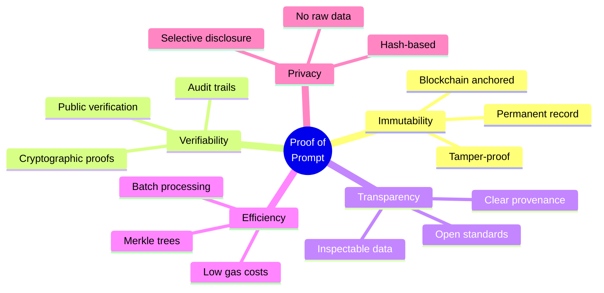
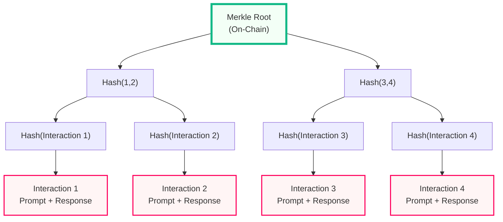
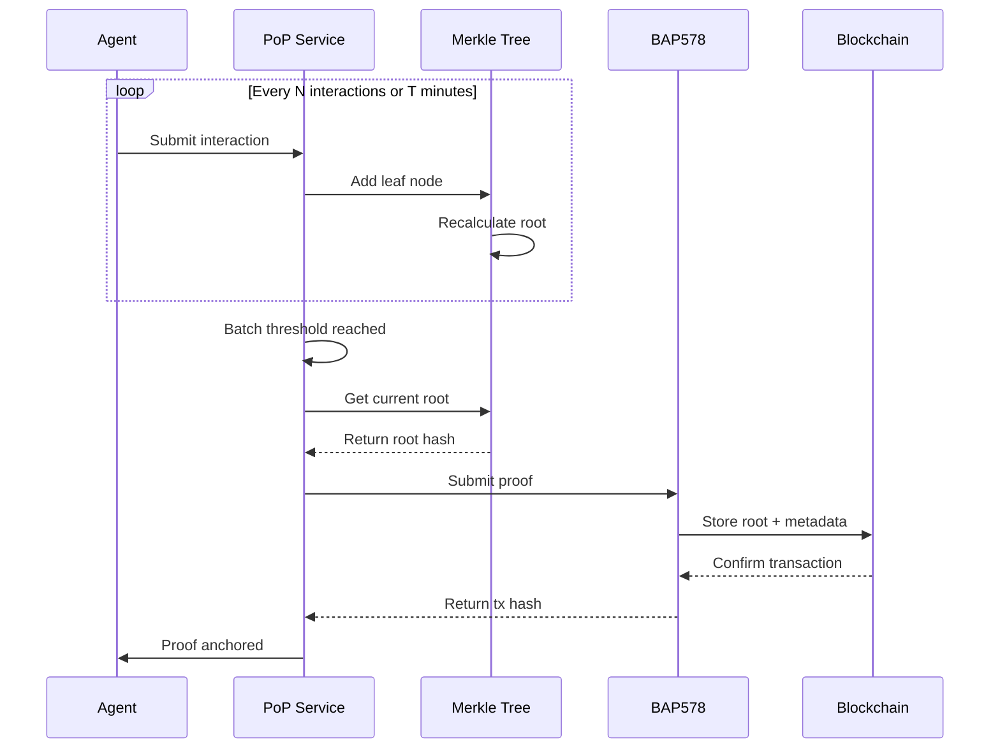
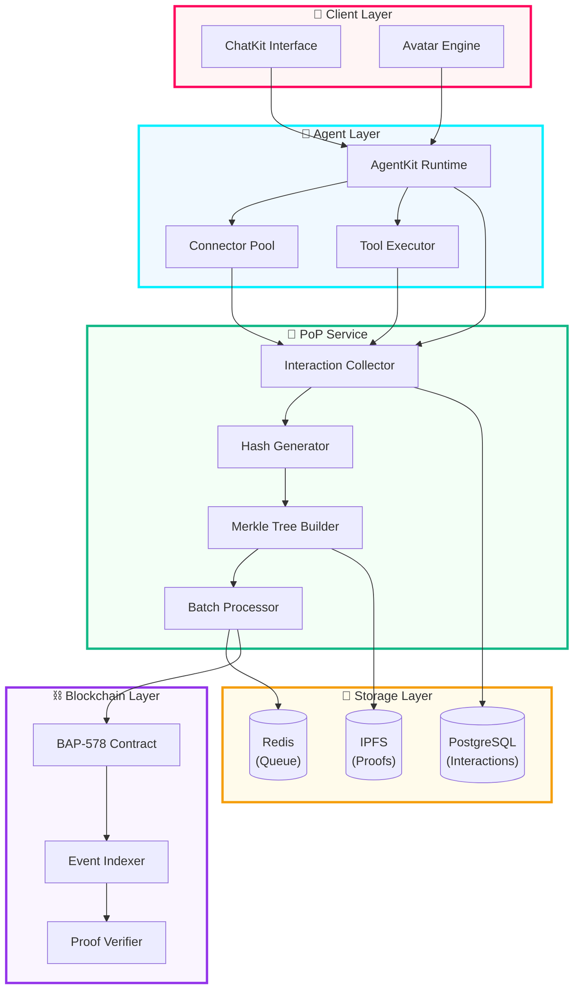
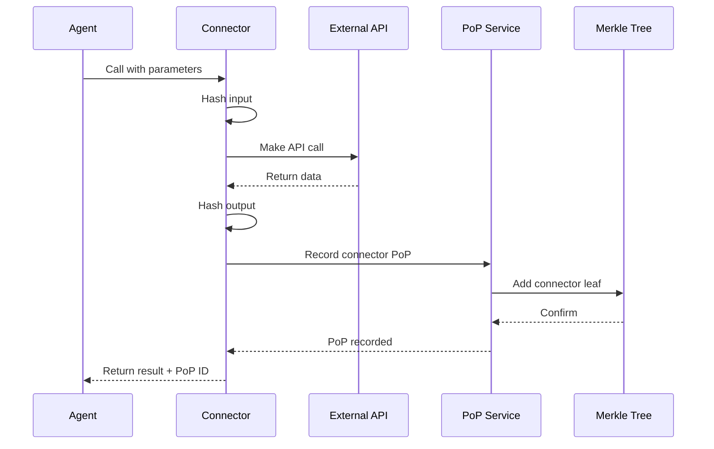
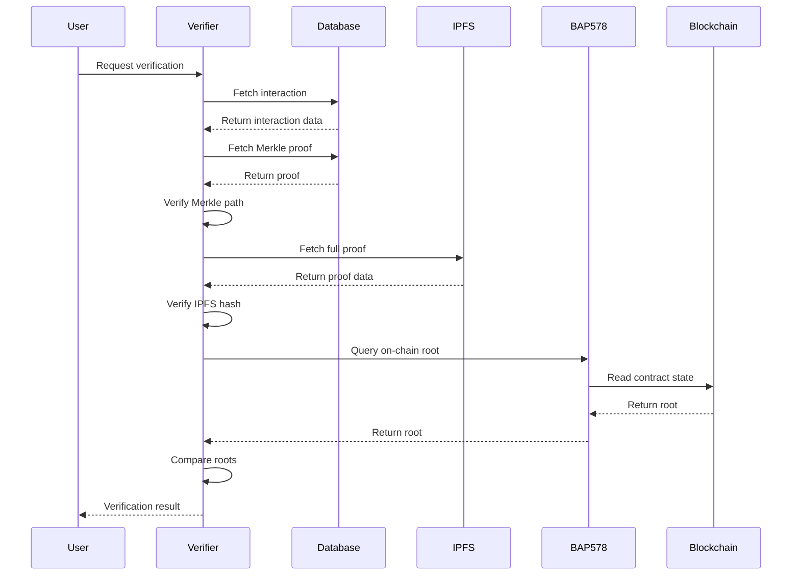

# 🔐 Proof of Prompt (PoP) Specification

**NFA × AgentKit Implementation Playbook**  
**Version:** 1.0.0  
**Last Updated:** October 7, 2025  

---

## 📋 Table of Contents

- [Overview](#overview)
- [Core Concepts](#core-concepts)
- [PoP Architecture](#pop-architecture)
- [Connector Integration](#connector-integration)
- [Data Structures](#data-structures)
- [Implementation Guide](#implementation-guide)
- [Verification Process](#verification-process)
- [Security Considerations](#security-considerations)
- [Performance Optimization](#performance-optimization)
- [Examples](#examples)

---

## 🎯 Overview

**Proof of Prompt (PoP)** is a cryptographic verification system that creates immutable, verifiable records of agent-user interactions. It ensures transparency, accountability, and trust in AI agent operations by anchoring interaction hashes to the blockchain via BAP-578.

### Key Features



### Why PoP Matters

| Stakeholder | Benefit |
|-------------|---------|
| **Users** | Verify agent responses, prove interactions occurred |
| **Developers** | Debug issues, audit agent behavior, compliance |
| **Regulators** | Transparent AI operations, accountability |
| **Marketplace** | Trust signals, quality metrics, reputation |

---

## 🧠 Core Concepts

### 1. Interaction Hash

Every agent interaction is hashed using SHA-256:

```typescript
interface Interaction {
  promptHash: string;      // SHA-256 of user prompt
  responseHash: string;    // SHA-256 of agent response
  contextHash: string;     // SHA-256 of conversation context
  toolsUsed: string[];     // List of connector/tool IDs
  timestamp: number;       // Unix timestamp
  agentId: string;         // NFA token ID
  userId: string;          // User identifier (hashed)
}

function hashInteraction(interaction: Interaction): string {
  const data = JSON.stringify({
    prompt: interaction.promptHash,
    response: interaction.responseHash,
    context: interaction.contextHash,
    tools: interaction.toolsUsed.sort(),
    timestamp: interaction.timestamp,
    agent: interaction.agentId,
    user: interaction.userId
  });
  
  return sha256(data);
}
```

### 2. Merkle Tree Structure

Interactions are organized into Merkle trees for efficient batch verification:



### 3. Batch Anchoring

Merkle roots are periodically anchored to BAP-578:



---

## 🏗️ PoP Architecture

### System Components



### Data Flow

```mermaid
flowchart LR
    A["User Prompt"] --> B["Agent Processing"]
    B --> C["Connector Calls"]
    C --> D["Response Generation"]
    D --> E["Hash Components"]
    E --> F["Create Leaf Node"]
    F --> G["Update Merkle Tree"]
    G --> H{"Batch Ready?"}
    H -->|No| I["Queue for Next Batch"]
    H -->|Yes| J["Calculate Root"]
    J --> K["Sign Root"]
    K --> L["Submit to BAP-578"]
    L --> M["Store Proof on IPFS"]
    M --> N["Update Agent Metadata"]
    
    style A fill:#fff5f5,stroke:#FF005C,stroke-width:2px
    style N fill:#f3fff6,stroke:#12b886,stroke-width:2px
```



---

## 🔌 Connector Integration

### Connector PoP Requirements

Every connector MUST implement PoP tracking for transparency and auditability:

```typescript
interface ConnectorPoP {
  connectorId: string;        // Unique connector identifier
  connectorVersion: string;   // Semantic version
  callTimestamp: number;      // When connector was invoked
  inputHash: string;          // SHA-256 of input parameters
  outputHash: string;         // SHA-256 of output data
  executionTime: number;      // Milliseconds
  success: boolean;           // Call succeeded?
  errorHash?: string;         // SHA-256 of error (if failed)
}

class BaseConnector {
  async execute(input: any): Promise<any> {
    const startTime = Date.now();
    const inputHash = sha256(JSON.stringify(input));
    
    try {
      const output = await this.performAction(input);
      const outputHash = sha256(JSON.stringify(output));
      
      await this.recordPoP({
        connectorId: this.id,
        connectorVersion: this.version,
        callTimestamp: startTime,
        inputHash,
        outputHash,
        executionTime: Date.now() - startTime,
        success: true
      });
      
      return output;
    } catch (error) {
      const errorHash = sha256(error.message);
      
      await this.recordPoP({
        connectorId: this.id,
        connectorVersion: this.version,
        callTimestamp: startTime,
        inputHash,
        outputHash: '',
        executionTime: Date.now() - startTime,
        success: false,
        errorHash
      });
      
      throw error;
    }
  }
  
  private async recordPoP(pop: ConnectorPoP): Promise<void> {
    await popService.recordConnectorCall(pop);
  }
}
```

### Connector Call Chain



### Multi-Connector Interactions

When an agent uses multiple connectors in a single interaction:

```typescript
interface MultiConnectorPoP {
  interactionId: string;
  connectorCalls: ConnectorPoP[];
  callSequence: string[];      // Order of connector calls
  totalExecutionTime: number;
  aggregateHash: string;       // Hash of all connector hashes
}

function createMultiConnectorPoP(
  interactionId: string,
  calls: ConnectorPoP[]
): MultiConnectorPoP {
  const sortedCalls = calls.sort((a, b) => 
    a.callTimestamp - b.callTimestamp
  );
  
  const callSequence = sortedCalls.map(c => c.connectorId);
  const totalTime = sortedCalls.reduce((sum, c) => 
    sum + c.executionTime, 0
  );
  
  const aggregateHash = sha256(
    sortedCalls.map(c => c.outputHash).join('')
  );
  
  return {
    interactionId,
    connectorCalls: sortedCalls,
    callSequence,
    totalExecutionTime: totalTime,
    aggregateHash
  };
}
```

### Connector-Specific PoP Examples

#### Example 1: Web Search Connector

```typescript
class WebSearchConnector extends BaseConnector {
  async search(query: string): Promise<SearchResults> {
    const input = { query, timestamp: Date.now() };
    const inputHash = sha256(JSON.stringify(input));
    
    const results = await this.performSearch(query);
    const outputHash = sha256(JSON.stringify({
      resultCount: results.length,
      topResultUrls: results.slice(0, 5).map(r => r.url)
    }));
    
    await this.recordPoP({
      connectorId: 'web-search',
      connectorVersion: '1.0.0',
      callTimestamp: Date.now(),
      inputHash,
      outputHash,
      executionTime: 250,
      success: true
    });
    
    return results;
  }
}
```

#### Example 2: Database Connector

```typescript
class DatabaseConnector extends BaseConnector {
  async query(sql: string, params: any[]): Promise<any[]> {
    const input = { 
      sqlHash: sha256(sql),  // Don't expose raw SQL
      paramCount: params.length 
    };
    const inputHash = sha256(JSON.stringify(input));
    
    const rows = await this.executeQuery(sql, params);
    const outputHash = sha256(JSON.stringify({
      rowCount: rows.length,
      columnCount: Object.keys(rows[0] || {}).length
    }));
    
    await this.recordPoP({
      connectorId: 'database',
      connectorVersion: '2.1.0',
      callTimestamp: Date.now(),
      inputHash,
      outputHash,
      executionTime: 45,
      success: true
    });
    
    return rows;
  }
}
```

#### Example 3: Email Connector

```typescript
class EmailConnector extends BaseConnector {
  async send(to: string, subject: string, body: string): Promise<void> {
    const input = {
      toHash: sha256(to),        // Privacy: hash email
      subjectHash: sha256(subject),
      bodyLength: body.length
    };
    const inputHash = sha256(JSON.stringify(input));
    
    await this.sendEmail(to, subject, body);
    const outputHash = sha256(JSON.stringify({
      sent: true,
      timestamp: Date.now()
    }));
    
    await this.recordPoP({
      connectorId: 'email',
      connectorVersion: '1.5.0',
      callTimestamp: Date.now(),
      inputHash,
      outputHash,
      executionTime: 1200,
      success: true
    });
  }
}
```

---

## 📊 Data Structures

### Interaction Record

```typescript
interface InteractionRecord {
  // Identity
  id: string;                    // UUID
  agentTokenId: string;          // NFA token ID
  userId: string;                // Hashed user ID
  sessionId: string;             // Session identifier
  
  // Content Hashes
  promptHash: string;            // SHA-256 of prompt
  responseHash: string;          // SHA-256 of response
  contextHash: string;           // SHA-256 of context
  
  // Connector Data
  connectorCalls: ConnectorPoP[];
  multiConnectorHash?: string;   // Aggregate hash
  
  // Metadata
  timestamp: number;             // Unix timestamp
  duration: number;              // Milliseconds
  tokenUsage: {
    input: number;
    output: number;
  };
  
  // PoP Data
  merkleLeafHash: string;        // Hash in Merkle tree
  merkleProof?: string[];        // Proof path
  merkleRoot?: string;           // Root when anchored
  blockchainTxHash?: string;     // BAP-578 tx hash
  ipfsProofCid?: string;         // IPFS CID of full proof
  
  // Status
  status: 'pending' | 'batched' | 'anchored' | 'verified';
  createdAt: Date;
  anchoredAt?: Date;
}
```

### Merkle Proof

```typescript
interface MerkleProof {
  // Identification
  proofId: string;
  interactionId: string;
  agentTokenId: string;
  
  // Tree Structure
  leafHash: string;              // Hash of interaction
  leafIndex: number;             // Position in tree
  proofPath: string[];           // Sibling hashes
  root: string;                  // Merkle root
  treeSize: number;              // Total leaves
  
  // Blockchain Anchor
  blockchainTxHash: string;      // Transaction hash
  blockNumber: number;           // Block number
  blockTimestamp: number;        // Block timestamp
  
  // Verification
  verified: boolean;
  verifiedAt?: Date;
  verificationSignature?: string;
  
  // Storage
  ipfsCid: string;               // Full proof on IPFS
  createdAt: Date;
}
```

### Batch Metadata

```typescript
interface BatchMetadata {
  // Identification
  batchId: string;
  agentTokenId: string;
  
  // Batch Contents
  interactionIds: string[];
  interactionCount: number;
  startTimestamp: number;
  endTimestamp: number;
  
  // Merkle Tree
  merkleRoot: string;
  treeHeight: number;
  
  // Connector Statistics
  connectorUsage: {
    [connectorId: string]: {
      callCount: number;
      totalExecutionTime: number;
      successRate: number;
    };
  };
  
  // Blockchain
  blockchainTxHash: string;
  gasUsed: number;
  
  // Storage
  ipfsCid: string;
  createdAt: Date;
}
```

---

## 🛠️ Implementation Guide

### Step 1: Initialize PoP Service

```typescript
import { PoPService } from '@nfa/proof-of-prompt';
import { BAP578Client } from '@nfa/bap578';
import { IPFSClient } from '@nfa/ipfs';

const popService = new PoPService({
  database: {
    url: process.env.DATABASE_URL,
    poolSize: 20
  },
  redis: {
    url: process.env.REDIS_URL
  },
  ipfs: new IPFSClient({
    apiUrl: process.env.IPFS_API_URL,
    apiKey: process.env.IPFS_API_KEY
  }),
  blockchain: new BAP578Client({
    contractAddress: process.env.BAP578_CONTRACT,
    privateKey: process.env.WALLET_PRIVATE_KEY
  }),
  batching: {
    maxInteractions: 100,      // Batch after 100 interactions
    maxWaitTime: 300000,       // Or 5 minutes
    minInteractions: 10        // Minimum batch size
  }
});

await popService.initialize();
```

### Step 2: Record Interactions

```typescript
async function handleAgentInteraction(
  agentId: string,
  userId: string,
  prompt: string,
  response: string,
  connectorCalls: ConnectorPoP[]
): Promise<string> {
  // Hash components
  const promptHash = sha256(prompt);
  const responseHash = sha256(response);
  const contextHash = sha256(getConversationContext(userId));
  
  // Create interaction record
  const interaction: InteractionRecord = {
    id: generateUUID(),
    agentTokenId: agentId,
    userId: sha256(userId),
    sessionId: getSessionId(userId),
    promptHash,
    responseHash,
    contextHash,
    connectorCalls,
    multiConnectorHash: connectorCalls.length > 0 
      ? sha256(connectorCalls.map(c => c.outputHash).join(''))
      : undefined,
    timestamp: Date.now(),
    duration: calculateDuration(),
    tokenUsage: {
      input: countTokens(prompt),
      output: countTokens(response)
    },
    merkleLeafHash: '',  // Calculated by PoP service
    status: 'pending',
    createdAt: new Date()
  };
  
  // Submit to PoP service
  const popId = await popService.recordInteraction(interaction);
  
  return popId;
}
```

### Step 3: Batch Processing

```typescript
class PoPBatchProcessor {
  private pendingInteractions: InteractionRecord[] = [];
  private batchTimer: NodeJS.Timeout | null = null;
  
  async addInteraction(interaction: InteractionRecord): Promise<void> {
    this.pendingInteractions.push(interaction);
    
    // Check if batch is ready
    if (this.shouldProcessBatch()) {
      await this.processBatch();
    } else if (!this.batchTimer) {
      // Start timer for max wait time
      this.batchTimer = setTimeout(
        () => this.processBatch(),
        this.config.maxWaitTime
      );
    }
  }
  
  private shouldProcessBatch(): boolean {
    return this.pendingInteractions.length >= this.config.maxInteractions;
  }
  
  private async processBatch(): Promise<void> {
    if (this.pendingInteractions.length < this.config.minInteractions) {
      return; // Wait for more interactions
    }
    
    const batch = this.pendingInteractions.splice(0);
    
    // Clear timer
    if (this.batchTimer) {
      clearTimeout(this.batchTimer);
      this.batchTimer = null;
    }
    
    // Build Merkle tree
    const tree = new MerkleTree(
      batch.map(i => this.hashInteraction(i))
    );
    const root = tree.getRoot();
    
    // Store proofs
    for (let i = 0; i < batch.length; i++) {
      const proof = tree.getProof(i);
      await this.storeProof(batch[i].id, proof, root);
    }
    
    // Anchor to blockchain
    const txHash = await this.anchorToBlockchain(root, batch);
    
    // Store batch metadata on IPFS
    const ipfsCid = await this.storeBatchMetadata(batch, root, txHash);
    
    // Update interaction records
    await this.updateInteractionStatus(batch, root, txHash, ipfsCid);
  }
  
  private async anchorToBlockchain(
    root: string,
    batch: InteractionRecord[]
  ): Promise<string> {
    const metadata = {
      merkleRoot: root,
      interactionCount: batch.length,
      timestamp: Date.now(),
      agentTokenId: batch[0].agentTokenId
    };
    
    const tx = await this.bap578Client.addProof(
      batch[0].agentTokenId,
      root,
      batch.length,
      metadata
    );
    
    return tx.hash;
  }
}
```

### Step 4: Verification

```typescript
async function verifyInteraction(
  interactionId: string
): Promise<VerificationResult> {
  // Fetch interaction and proof
  const interaction = await popService.getInteraction(interactionId);
  const proof = await popService.getProof(interactionId);
  
  // Verify Merkle proof
  const merkleValid = verifyMerkleProof(
    interaction.merkleLeafHash,
    proof.proofPath,
    proof.root
  );
  
  if (!merkleValid) {
    return {
      valid: false,
      reason: 'Invalid Merkle proof'
    };
  }
  
  // Verify blockchain anchor
  const onChainRoot = await bap578Client.getProofRoot(
    interaction.agentTokenId,
    proof.blockchainTxHash
  );
  
  if (onChainRoot !== proof.root) {
    return {
      valid: false,
      reason: 'Merkle root mismatch with blockchain'
    };
  }
  
  // Verify IPFS data
  const ipfsData = await ipfsClient.get(proof.ipfsCid);
  const ipfsHash = sha256(JSON.stringify(ipfsData));
  
  if (ipfsHash !== proof.root) {
    return {
      valid: false,
      reason: 'IPFS data mismatch'
    };
  }
  
  return {
    valid: true,
    proof,
    verifiedAt: new Date()
  };
}

function verifyMerkleProof(
  leaf: string,
  proof: string[],
  root: string
): boolean {
  let hash = leaf;
  
  for (const sibling of proof) {
    hash = sha256(
      [hash, sibling].sort().join('')
    );
  }
  
  return hash === root;
}
```

---

## 🔍 Verification Process

### Public Verification Flow



### Verification API

```typescript
// Public verification endpoint
app.get('/api/verify/:interactionId', async (req, res) => {
  const { interactionId } = req.params;
  
  try {
    const result = await verifyInteraction(interactionId);
    
    res.json({
      interactionId,
      valid: result.valid,
      proof: result.proof,
      verifiedAt: result.verifiedAt,
      reason: result.reason
    });
  } catch (error) {
    res.status(500).json({
      error: 'Verification failed',
      message: error.message
    });
  }
});

// Batch verification endpoint
app.post('/api/verify/batch', async (req, res) => {
  const { interactionIds } = req.body;
  
  const results = await Promise.all(
    interactionIds.map(id => verifyInteraction(id))
  );
  
  res.json({
    total: results.length,
    valid: results.filter(r => r.valid).length,
    invalid: results.filter(r => !r.valid).length,
    results
  });
});
```

---

## 🔒 Security Considerations

### Privacy Protection

```typescript
// Hash sensitive data before storing
function hashSensitiveData(data: any): string {
  // Add salt for additional security
  const salt = process.env.POP_SALT;
  return sha256(JSON.stringify(data) + salt);
}

// Example: Hash user email
const userIdHash = hashSensitiveData(user.email);

// Example: Hash prompt (preserve privacy)
const promptHash = hashSensitiveData(prompt);
```

### Connector Security

```typescript
class SecureConnector extends BaseConnector {
  async execute(input: any): Promise<any> {
    // Validate input
    this.validateInput(input);
    
    // Sanitize sensitive data before hashing
    const sanitizedInput = this.sanitizeInput(input);
    const inputHash = sha256(JSON.stringify(sanitizedInput));
    
    // Execute with timeout
    const output = await Promise.race([
      this.performAction(input),
      this.timeout(30000)
    ]);
    
    // Sanitize output before hashing
    const sanitizedOutput = this.sanitizeOutput(output);
    const outputHash = sha256(JSON.stringify(sanitizedOutput));
    
    await this.recordPoP({
      connectorId: this.id,
      inputHash,
      outputHash,
      // ... other fields
    });
    
    return output;
  }
  
  private sanitizeInput(input: any): any {
    // Remove API keys, passwords, tokens
    const sanitized = { ...input };
    delete sanitized.apiKey;
    delete sanitized.password;
    delete sanitized.token;
    return sanitized;
  }
  
  private sanitizeOutput(output: any): any {
    // Remove sensitive response data
    const sanitized = { ...output };
    delete sanitized.privateKey;
    delete sanitized.secret;
    return sanitized;
  }
}
```

### Signature Verification

```typescript
import { ethers } from 'ethers';

async function signMerkleRoot(
  root: string,
  privateKey: string
): Promise<string> {
  const wallet = new ethers.Wallet(privateKey);
  const message = ethers.utils.arrayify(root);
  const signature = await wallet.signMessage(message);
  return signature;
}

async function verifySignature(
  root: string,
  signature: string,
  expectedAddress: string
): Promise<boolean> {
  const message = ethers.utils.arrayify(root);
  const recoveredAddress = ethers.utils.verifyMessage(message, signature);
  return recoveredAddress.toLowerCase() === expectedAddress.toLowerCase();
}
```

---

## ⚡ Performance Optimization

### Batch Size Tuning

```typescript
// Dynamic batch sizing based on load
class AdaptiveBatchProcessor {
  private currentBatchSize: number = 50;
  private readonly minBatchSize = 10;
  private readonly maxBatchSize = 200;
  
  adjustBatchSize(metrics: PerformanceMetrics): void {
    const { avgProcessingTime, queueLength } = metrics;
    
    if (avgProcessingTime > 5000 && this.currentBatchSize > this.minBatchSize) {
      // Processing too slow, reduce batch size
      this.currentBatchSize = Math.max(
        this.minBatchSize,
        this.currentBatchSize - 10
      );
    } else if (queueLength > 500 && this.currentBatchSize < this.maxBatchSize) {
      // Queue building up, increase batch size
      this.currentBatchSize = Math.min(
        this.maxBatchSize,
        this.currentBatchSize + 10
      );
    }
  }
}
```

### Parallel Processing

```typescript
async function processBatchParallel(
  interactions: InteractionRecord[]
): Promise<void> {
  // Process in chunks
  const chunkSize = 10;
  const chunks = [];
  
  for (let i = 0; i < interactions.length; i += chunkSize) {
    chunks.push(interactions.slice(i, i + chunkSize));
  }
  
  // Process chunks in parallel
  await Promise.all(
    chunks.map(chunk => processChunk(chunk))
  );
}

async function processChunk(
  chunk: InteractionRecord[]
): Promise<void> {
  // Hash interactions in parallel
  const hashes = await Promise.all(
    chunk.map(i => hashInteraction(i))
  );
  
  // Store in database
  await database.batchInsert(chunk, hashes);
}
```

### Caching Strategy

```typescript
class PoPCache {
  private redis: Redis;
  private readonly TTL = 3600; // 1 hour
  
  async getProof(interactionId: string): Promise<MerkleProof | null> {
    const cached = await this.redis.get(`proof:${interactionId}`);
    if (cached) {
      return JSON.parse(cached);
    }
    
    const proof = await database.getProof(interactionId);
    if (proof) {
      await this.redis.setex(
        `proof:${interactionId}`,
        this.TTL,
        JSON.stringify(proof)
      );
    }
    
    return proof;
  }
  
  async invalidate(interactionId: string): Promise<void> {
    await this.redis.del(`proof:${interactionId}`);
  }
}
```

---

## 📚 Examples

### Example 1: Simple Interaction

```typescript
// User asks a question
const prompt = "What's the weather in San Francisco?";

// Agent uses weather connector
const weatherData = await weatherConnector.getCurrentWeather('San Francisco');

// Agent generates response
const response = `The weather in San Francisco is ${weatherData.temp}°F and ${weatherData.condition}.`;

// Record PoP
const popId = await popService.recordInteraction({
  agentTokenId: 'nfa_123',
  userId: sha256('user@example.com'),
  promptHash: sha256(prompt),
  responseHash: sha256(response),
  connectorCalls: [
    {
      connectorId: 'weather-api',
      connectorVersion: '1.0.0',
      inputHash: sha256(JSON.stringify({ city: 'San Francisco' })),
      outputHash: sha256(JSON.stringify(weatherData)),
      executionTime: 150,
      success: true
    }
  ],
  timestamp: Date.now()
});

console.log(`PoP recorded: ${popId}`);
```

### Example 2: Multi-Connector Workflow

```typescript
// User requests a complex task
const prompt = "Find the latest news about AI and email me a summary";

// Agent uses multiple connectors
const newsResults = await webSearchConnector.search('AI news');
const summary = await gpt5.summarize(newsResults);
await emailConnector.send(
  user.email,
  'AI News Summary',
  summary
);

// Record PoP with multiple connector calls
const popId = await popService.recordInteraction({
  agentTokenId: 'nfa_456',
  userId: sha256(user.email),
  promptHash: sha256(prompt),
  responseHash: sha256('Email sent successfully'),
  connectorCalls: [
    {
      connectorId: 'web-search',
      inputHash: sha256(JSON.stringify({ query: 'AI news' })),
      outputHash: sha256(JSON.stringify(newsResults)),
      executionTime: 250,
      success: true
    },
    {
      connectorId: 'gpt-5',
      inputHash: sha256(JSON.stringify(newsResults)),
      outputHash: sha256(summary),
      executionTime: 1200,
      success: true
    },
    {
      connectorId: 'email',
      inputHash: sha256(JSON.stringify({ to: user.email })),
      outputHash: sha256(JSON.stringify({ sent: true })),
      executionTime: 800,
      success: true
    }
  ],
  timestamp: Date.now()
});
```

### Example 3: Verification

```typescript
// Verify an interaction
const result = await verifyInteraction('interaction_789');

if (result.valid) {
  console.log('✅ Interaction verified!');
  console.log(`Merkle root: ${result.proof.root}`);
  console.log(`Blockchain tx: ${result.proof.blockchainTxHash}`);
  console.log(`IPFS CID: ${result.proof.ipfsCid}`);
} else {
  console.log('❌ Verification failed:', result.reason);
}
```

---

## 🔗 Related Documentation

- [API Reference](./API.md) - Complete API documentation
- [Connector Guide](./CONNECTORS.md) - Building custom connectors
- [Security Best Practices](./SECURITY.md) - Security guidelines
- [Architecture Overview](./ARCHITECTURE.md) - System architecture

---

## 📄 License

MIT License - see [LICENSE](LICENSE) for details

