# 🌐 NFA × AgentKit Implementation Playbook

**Date:** October 7, 2025  
**Stack:** GPT-5 Realtime • AgentKit (Agents SDK) • ChatKit • BAP-578 (NFA) • Supabase/VectorDB • IPFS  

---

## 🧩 Overview

This playbook provides engineers with everything needed to build **Non-Fungible Agents (NFAs)** integrated with **OpenAI's AgentKit** — combining real-time GPT-5 execution, visual avatars, and verifiable on-chain identity via **BAP-578**.

It includes:
- 🔧 Architecture & workflow diagrams  
- 🧠 Proof of Prompt (PoP) schema  
- 🚀 API checklists per workflow  
- 💾 JSON templates for rapid deployment  

---

## 📐 Full-Stack Architecture

```mermaid
graph TB
    subgraph CLIENT["🎨 Client Layer"]
        WEB["Web UI<br/>(Next.js)"]
        MOBILE["Mobile App<br/>(React Native)"]
        CHATKIT["ChatKit Embed<br/>(iframe/SDK)"]
        AVATAR["Avatar Engine<br/>(LiveKit + GPT-5)"]
    end

    subgraph SERVICE["⚡ Service Layer"]
        APIGW["API Gateway<br/>(K8s/Nginx)<br/>Auth • Rate Limiting"]
        
        AGENTKIT["AgentKit Runtime<br/>(OpenAI SDK)"]
        BUILDER["Agent Builder<br/>(Graph Engine)"]
        WORKFLOW["Workflow Engine<br/>(Temporal)"]
        
        GPT5["GPT-5 Realtime"]
        CONNECTORS["Connector Pool<br/>(Zendesk • Stripe • Email)"]
        TOOLS["Tool Executor<br/>(Sandboxed)"]
    end

    subgraph DATA["💾 Data Layer"]
        POSTGRES[("PostgreSQL<br/>(Supabase)")]
        VECTOR[("Vector DB<br/>(Pinecone)")]
        REDIS[("Redis<br/>(Cache)")]
        IPFS[("IPFS<br/>(Assets)")]
        
        BAP578["BAP-578<br/>(NFA Contract)"]
        INDEXER["Chain Indexer"]
    end

    subgraph INFRA["🔧 Infrastructure Layer"]
        MONITOR["Monitoring<br/>(Prometheus)"]
        LOGS["Logs<br/>(Loki)"]
        CDN["CDN<br/>(CloudFlare)"]
    end

    WEB --> APIGW
    MOBILE --> APIGW
    CHATKIT --> APIGW
    AVATAR --> APIGW
    
    APIGW --> AGENTKIT
    AGENTKIT --> BUILDER
    AGENTKIT --> WORKFLOW
    AGENTKIT --> GPT5
    AGENTKIT --> CONNECTORS
    AGENTKIT --> TOOLS
    
    AGENTKIT --> POSTGRES
    AGENTKIT --> VECTOR
    AGENTKIT --> REDIS
    AGENTKIT --> IPFS
    AGENTKIT --> BAP578
    BAP578 --> INDEXER
    
    SERVICE --> MONITOR
    SERVICE --> LOGS
    APIGW --> CDN

    style CLIENT fill:#fff5f5,stroke:#FF005C,stroke-width:3px
    style SERVICE fill:#f0f9ff,stroke:#00F0FF,stroke-width:3px
    style DATA fill:#f3fff6,stroke:#12b886,stroke-width:3px
    style INFRA fill:#fffbeb,stroke:#f59e0b,stroke-width:3px
```



---

## 🔄 Core Workflows

### 1️⃣ Agent Creation & Deployment


### 2️⃣ Real-Time Conversation Flow


### 3️⃣ Proof of Prompt (PoP) Generation


---

## 🏗️ Component Breakdown

### 🎨 Client Layer

| Component | Technology | Purpose |
|-----------|-----------|---------|
| **ChatKit** | React/Next.js | Embeddable chat interface |
| **Avatar Engine** | LiveKit + GPT-5 Realtime | Real-time voice & video |
| **Agent Studio** | Drag-and-drop UI | Visual agent builder |

### 🤖 Agent Orchestration

| Component | Technology | Purpose |
|-----------|-----------|---------|
| **AgentKit** | OpenAI Agents SDK | Core agent runtime |
| **Agent Graphs** | Node-based workflows | Skill composition |
| **Guardrails** | Custom validators | Safety & compliance |
| **Temporal** | Durable execution | Long-running workflows |

### 🔧 Tools & Connectors


### 💾 State & Memory

| Component | Technology | Purpose |
|-----------|-----------|---------|
| **Vector DB** | Pinecone/Weaviate | Semantic memory |
| **Object Storage** | IPFS/S3 | Assets & media |
| **Relational DB** | Supabase (Postgres) | Structured data |

### ⛓️ On-Chain Identity (BAP-578)


---

## 🚀 Quick Start Guide

### Prerequisites

```bash
# Required tools
node >= 18.0.0
npm >= 9.0.0
git
docker (optional)
```

### Installation

```bash
# Clone the repository
git clone https://github.com/your-org/nfa-agentkit.git
cd nfa-agentkit

# Install dependencies
npm install

# Set up environment variables
cp .env.example .env
# Edit .env with your API keys:
# - OPENAI_API_KEY
# - SUPABASE_URL
# - SUPABASE_ANON_KEY
# - IPFS_API_KEY
# - BAP578_CONTRACT_ADDRESS

# Run database migrations
npm run db:migrate

# Start development server
npm run dev
```

### Create Your First Agent

```typescript
import { AgentKit } from '@openai/agentkit';
import { BAP578 } from './contracts/BAP578';

// 1. Initialize AgentKit
const agent = new AgentKit({
  model: 'gpt-5-realtime',
  tools: ['web-search', 'calculator', 'email'],
  guardrails: {
    maxTokens: 4000,
    contentFilter: true,
    rateLimits: { rpm: 60 }
  }
});

// 2. Configure persona
agent.setPersona({
  name: 'TechSupport AI',
  description: 'Expert technical support agent',
  voice: 'professional-friendly',
  avatar: 'ipfs://QmX...'
});

// 3. Mint NFA token
const nfa = await BAP578.mint({
  owner: '0x...',
  personaHash: agent.getPersonaHash(),
  capabilityGraph: agent.getCapabilityGraph()
});

// 4. Deploy agent
await agent.deploy({
  nfaTokenId: nfa.tokenId,
  endpoint: 'wss://agents.yourapp.com'
});

console.log(`Agent deployed! Token ID: ${nfa.tokenId}`);
```

---

## 📊 Proof of Prompt (PoP) Schema

### Data Structure

```json
{
  "popId": "pop_abc123xyz",
  "agentTokenId": "42",
  "timestamp": "2025-10-07T14:30:00Z",
  "interaction": {
    "promptHash": "0x1a2b3c...",
    "responseHash": "0x4d5e6f...",
    "contextHash": "0x7g8h9i...",
    "toolsUsed": ["web-search", "calculator"],
    "duration": 2.3,
    "tokens": {
      "input": 150,
      "output": 320
    }
  },
  "merkleProof": {
    "root": "0xabc123...",
    "path": ["0xdef456...", "0xghi789..."],
    "leaf": "0xjkl012..."
  },
  "signature": "0x9876543210...",
  "verified": true
}
```

### Merkle Tree Construction


---

## 🔌 API Reference

### AgentKit Core APIs

#### Create Agent

```http
POST /api/agents
Content-Type: application/json

{
  "name": "Customer Support Bot",
  "model": "gpt-5-realtime",
  "persona": {
    "tone": "friendly",
    "expertise": ["product-support", "billing"]
  },
  "tools": ["zendesk", "stripe", "email"],
  "guardrails": {
    "maxTokens": 4000,
    "contentFilter": true
  }
}
```

#### Start Conversation

```http
POST /api/conversations
Content-Type: application/json

{
  "agentId": "agent_123",
  "userId": "user_456",
  "channel": "web",
  "context": {
    "previousMessages": [],
    "userProfile": {}
  }
}
```

#### Generate PoP

```http
POST /api/proof-of-prompt
Content-Type: application/json

{
  "agentTokenId": "42",
  "interactions": [
    {
      "prompt": "What's the weather?",
      "response": "It's sunny, 72°F",
      "timestamp": "2025-10-07T14:30:00Z"
    }
  ]
}
```

### BAP-578 Smart Contract APIs

#### Mint NFA

```solidity
function mint(
  address owner,
  string memory personaHash,
  string memory capabilityGraph
) public returns (uint256 tokenId)
```

#### Update Metadata

```solidity
function updateMetadata(
  uint256 tokenId,
  string memory newPersonaHash,
  uint256 version
) public onlyOwner
```

#### Add Proof of Prompt

```solidity
function addProof(
  uint256 tokenId,
  bytes32 merkleRoot,
  uint256 interactionCount
) public
```

---

## 🛠️ Development Checklist

### Phase 1: Foundation
- [ ] Set up AgentKit SDK
- [ ] Configure Supabase database
- [ ] Deploy BAP-578 smart contract
- [ ] Set up IPFS node
- [ ] Create ChatKit embed

### Phase 2: Core Features
- [ ] Implement agent builder UI
- [ ] Build connector registry
- [ ] Set up vector database
- [ ] Integrate GPT-5 Realtime
- [ ] Add avatar rendering

### Phase 3: On-Chain Integration
- [ ] Implement NFA minting
- [ ] Build PoP generation system
- [ ] Create metadata storage
- [ ] Add verification endpoints

### Phase 4: Marketplace
- [ ] Build listing interface
- [ ] Implement payment system
- [ ] Add royalty distribution
- [ ] Create preview system

### Phase 5: Production
- [ ] Load testing
- [ ] Security audit
- [ ] Documentation
- [ ] Launch marketing

---

## 🎯 Use Cases

### 1. Customer Support Agent


### 2. Personal Assistant


### 3. Trading Bot


---

## 🔐 Security Best Practices

### Authentication & Authorization

```typescript
// Implement JWT-based auth
import { verifyToken } from './auth';

app.use(async (req, res, next) => {
  const token = req.headers.authorization?.split(' ')[1];
  if (!token) return res.status(401).json({ error: 'Unauthorized' });
  
  try {
    const user = await verifyToken(token);
    req.user = user;
    next();
  } catch (error) {
    res.status(403).json({ error: 'Invalid token' });
  }
});
```

### Rate Limiting

```typescript
import rateLimit from 'express-rate-limit';

const limiter = rateLimit({
  windowMs: 15 * 60 * 1000, // 15 minutes
  max: 100, // limit each IP to 100 requests per windowMs
  message: 'Too many requests, please try again later'
});

app.use('/api/', limiter);
```

### Input Validation

```typescript
import { z } from 'zod';

const agentSchema = z.object({
  name: z.string().min(3).max(50),
  model: z.enum(['gpt-5-realtime', 'gpt-4-turbo']),
  tools: z.array(z.string()).max(10),
  guardrails: z.object({
    maxTokens: z.number().min(100).max(8000),
    contentFilter: z.boolean()
  })
});

app.post('/api/agents', async (req, res) => {
  const result = agentSchema.safeParse(req.body);
  if (!result.success) {
    return res.status(400).json({ errors: result.error.errors });
  }
  // Process valid data
});
```

---

## 📈 Monitoring & Analytics

### Key Metrics


### Telemetry Setup

```typescript
import { trace } from '@opentelemetry/api';

const tracer = trace.getTracer('nfa-agentkit');

async function handleConversation(agentId: string, message: string) {
  const span = tracer.startSpan('conversation.handle');
  
  try {
    span.setAttribute('agent.id', agentId);
    span.setAttribute('message.length', message.length);
    
    const response = await agent.process(message);
    
    span.setAttribute('response.tokens', response.tokens);
    span.setStatus({ code: 0 }); // Success
    
    return response;
  } catch (error) {
    span.setStatus({ code: 2, message: error.message });
    throw error;
  } finally {
    span.end();
  }
}
```

---

## 🤝 Contributing

We welcome contributions! Please see our [Contributing Guide](CONTRIBUTING.md) for details.

### Development Workflow


---

## 📚 Resources

### Documentation
- [AgentKit SDK Docs](https://platform.openai.com/docs/agents)
- [BAP-578 Specification](https://github.com/bitcoin-sv/baps/blob/master/bap/0578.md)
- [ChatKit Integration Guide](https://docs.chatkit.io)
- [Supabase Docs](https://supabase.com/docs)

### Community
- [Discord Server](https://discord.gg/nfa-agentkit)
- [GitHub Discussions](https://github.com/your-org/nfa-agentkit/discussions)
- [Twitter](https://twitter.com/nfa_agentkit)

### Examples
- [Customer Support Bot](./examples/customer-support)
- [Personal Assistant](./examples/personal-assistant)
- [Trading Bot](./examples/trading-bot)

---

## 📄 License

MIT License - see [LICENSE](LICENSE) for details

---

## 🙏 Acknowledgments

Built with:
- OpenAI AgentKit
- Supabase
- IPFS
- LiveKit
- Temporal
- And many other amazing open-source projects

---

**Ready to build the future of AI agents?** 🚀

[Get Started](./docs/getting-started.md) | [View Examples](./examples) | [Join Community](https://discord.gg/nfa-agentkit)
